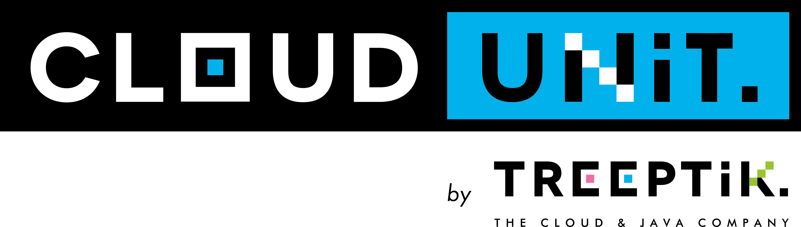
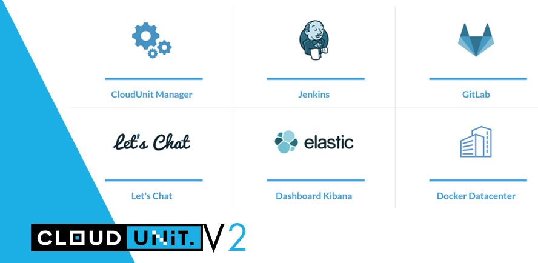
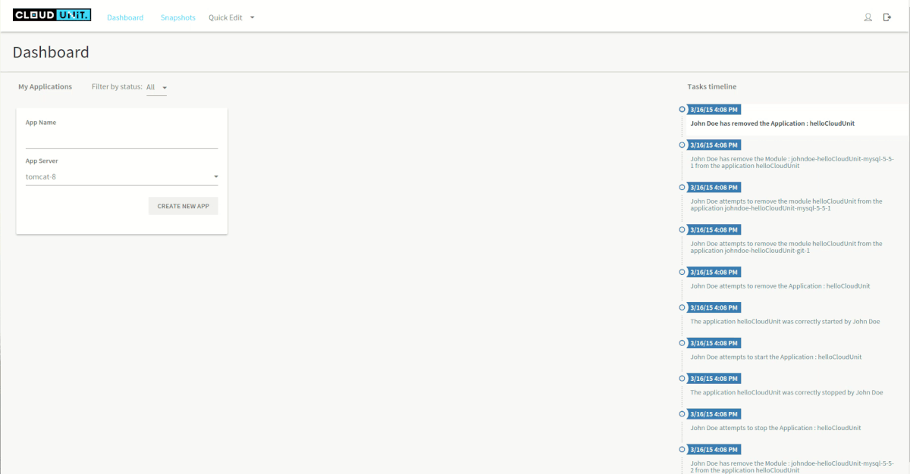

# The Turnkey Java Devops Plaform - 

Thanks to CloudUnit PaaS's powerful provisioning and execution capabilities, classical servers as Tomcat and JBoss, developers can build secure and scalable Java Web applications. So deploy your Java applications in the cloud almost instantly without changing your code.

CloudUnit takes care of the plumbing.

A complete plaform for devops featuring
* Docker with its friends : Compose, Machine and soon Swarm
* Jenkins 2 for CI/CD
* GitLab CE 
* EKL Stack for monitoring resources in a near future
* Sonar to analyse and reports in the future

Today we have many servers :
* Tomcat(s)
* JBoss / WildFly 10 in progress
* FatJar for SpringBoot, Vertx, PlayFramework...

And for modules :

* SQL databases : Mysql, PostGreSQL, PostGis.
* NoSQL databases : MongoDB
* Datagrids : Redis
* Message brokers : ActiveMQ, RabbitMQ

Each module in different major releases.

It is available in one edition for all major platforms which offers numerous extensions to fit the needs of all developers.

It is available under the terms of either the Affero GNU Public Licence 3.0

You can find more informations there : [CloudUnit Website](http://www.cloudunit.io/)

You can test the common platform online here (reseted all night)
* https://cu01.cloudunit.io :: [ johndoe / abc2015 ]

## Getting started

There are many installation guides
* [Server installation guide](documentation/SERVER-GUIDE.md)
* [Development guide Linux](documentation/DEV-GUIDE-LINUX.md)
* [Development guide MacOSX](documentation/DEV-GUIDE-MACOSX.md)
* [Add new module](documentation/MODULE-GUIDE.md)

## Go further
    
* [CloudUnit CLI guide](https://github.com/Treeptik/cloudunit/blob/dev/documentation/CLI-GUIDE.md)
* [CloudUnit Maven Plugin](https://github.com/Treeptik/cloudunit/tree/dev/cu-maven/README.md)

## Examples

* [MongoDB](documentation/MONGO_GUIDE.md) 
* [WordPress](documentation/WORDPRESS_GUIDE.md)

## Browsers Support

<table>
	<thead>
		<th></th>
		<th>Windows</th>
		<th>MacOS</th>
		<th>Linux</th>
	</thead>
	<tbody>
		<!-- Chrome -->
		<tr>
			<td>Chrome</td>
			<td>✓</td>
			<td>✓</td>
			<td>✓</td>
		</tr>
		<!-- Firefox -->
		<tr>
			<td>Firefox33</td>
			<td>✓</td>
			<td>✓</td>
			<td>✓</td>
		</tr>
		<!-- Opera -->
		<tr>
			<td>Opera</td>
			<td>✓</td>
			<td>?</td>
			<td>✓</td>
		</tr>
		<!-- Safari -->
		<tr>
			<td>Safari</td>
			<td>?</td>
			<td>✓</td>
			<td>-</td>
		</tr>
		<!-- Edge -->
		<tr>
			<td>Edge</td>
			<td>✓</td>
			<td>-</td>
			<td>-</td>
		</tr>
		<!-- IE -->
		<tr>
			<td>IE11</td>
			<td>✓</td>
			<td>-</td>
			<td>-</td>
		</tr>
	</tbody>
</table>

# Licensing

All the source code is licensed under GNU AFFERO GENERAL PUBLIC LICENSE. License is available [here](/LICENSE)
but CloudUnit is licensed too under a standard commercial license.
Please contact our sales team if you would like to discuss the specifics of our Enterprise license.
If you are not sure whether the AGPL is right for you,
you can always test our software under the AGPL and inspect the source code before you contact us
about purchasing a commercial license.

**Unless required by applicable law or agreed to in writing, software
distributed under the License is distributed on an "AS IS" BASIS,
WITHOUT WARRANTIES OR CONDITIONS OF ANY KIND, either express or implied.
See the License for the specific language governing permissions and
limitations under the License.**
  
# Legal terms

`CloudUnit` is a registered trademark of Treeptik and can't be used to endorse
or promote products derived from this project without prior written permission from `Treeptik`.
Products or services derived from this software may not be called `CloudUnit` nor may `Treeptik` 
or similar confusing terms appear in their names without prior written permission.

# Contact

For any questions, contact us : contact@treeptik.fr

Else ask your questions on [CloudUnit Google group](https://groups.google.com/forum/#!forum/cloudunit)

Copyright 2016 Treeptik

