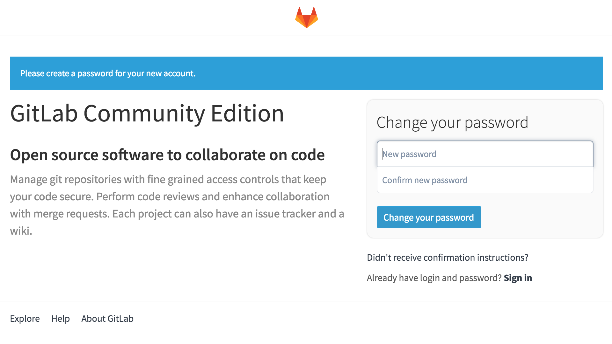
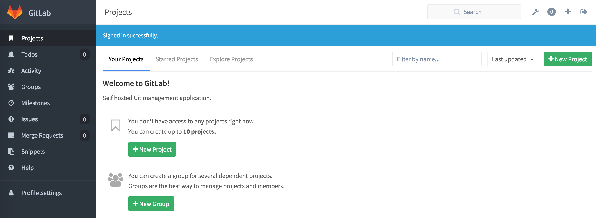
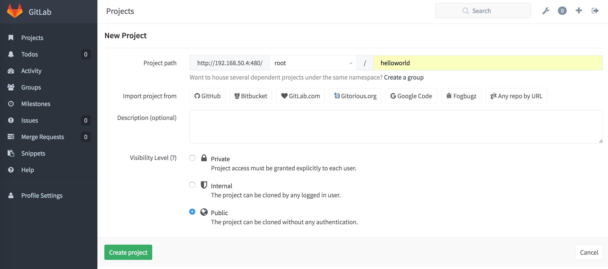

# OVERVIEW

TODO

# CONTEXT

At this day, CloudUnit provides Jenkins2 and GitLab-CE. 
We are working for a full distribution between all these products.
We want to have the same users and roles from CloudUnit to Jenkins2 and GitLab-CE.
CloudUnit will be the masterchief to admin the others products.

# INSTALLATION

## GitLab

Follow these steps during the first time to run and configure GitLab

Into the vagrantbox 
```
cd cloudunit/cu-platform
./gitlab.sh
````

Docker will pull the image 

````
Unable to find image 'gitlab/gitlab-ce:latest' locally
Pulling repository gitlab/gitlab-ce
b557757c1998: Download complete
426a0cc6d7b0: Download complete
23f6bd545c17: Download complete
e4082297a963: Download complete
06b50a41723d: Download complete
1880161e1eb6: Download complete
8ab98c7ec538: Download complete
245c703c3c85: Download complete
85585b72111d: Download complete
5efc762be96b: Download complete
bb93196f1588: Download complete
a34dcb070670: Download complete
d83d6f96580c: Download complete
8fbff104bcc5: Download complete
Status: Downloaded newer image for gitlab/gitlab-ce:latest
70a38bf4b8d9132c7dcdf1b319ee8572787e9127b48cb56d718ea1170fe10160
````

You can run this command to verify if everything is good.

```
docker ps | grep gitlab
70a38bf4b8d9 gitlab-ce:latest ... 0.0.0.0:422->22/tcp, 0.0.0.0:480->80/tcp, 0.0.0.0:4443->443/tcp 
```

So you have a container **gitlab** exposing its ports at 
* SSH at 422
* WebApp HTTP at 480
* API HTTPS at 4443

To access the application, you can open the URL [http://192.168.50.4:480](http://192.168.50.4:480).

    

`Choose a **root** password and note it preciously.`

`Create a new project.`

    

`Name it **helloworld**``

    


