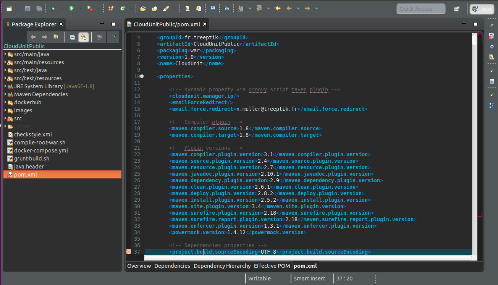
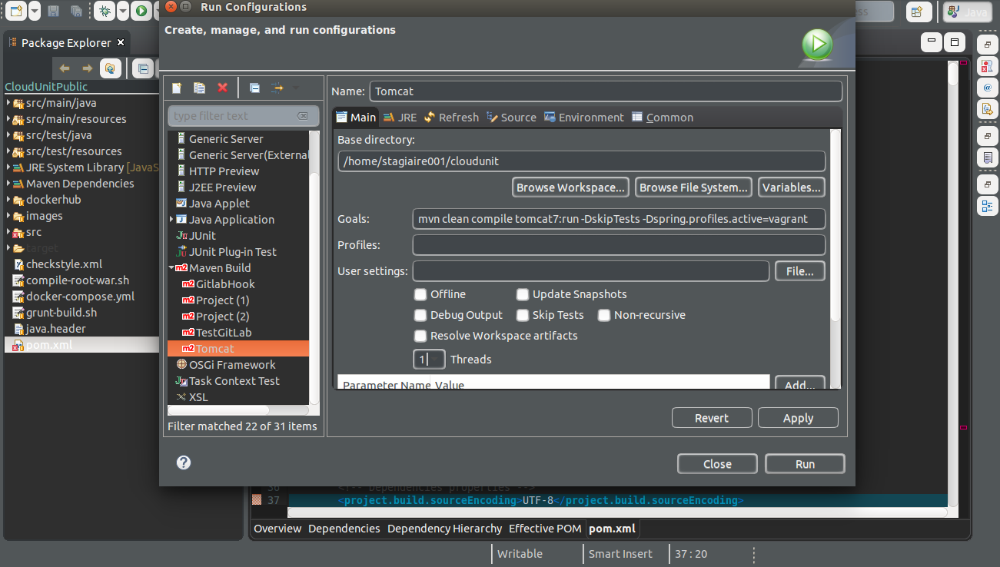

# CloudUnit developement environment

You are reading the wright guide, if you want to setup an environment to contribute to CloudUnit development.

## Requirements

* Linux Ubuntu/Debian
* Git / Java 1.8
* VirtualBox 5.0.4+ (www.virtualbox.org) - install before Vagrant
* Vagrant 1.8+ (www.vagrantup.com)
* Maven 3+ (maven.apache.org)

## Architecture for developpment

    

### General Rules

* You have to configure a local dns (see further) to send any requests from your host to VM (IP fixed at 192.168.50.4) 
* You use your favorite idea (intellij, Eclipse) to develop the maven project cloudunit
* The backend is a spring application exposing a REST API
* The frontend is an AngularJS 1.4 consuming the backend API from Spring Java
* You run the project with an embedded tomcat via maven tasks (tomcat:run). No need to install Tomcat locally.
* Mysql is included into vagrantbox so no need to install it locally.

### Architecture sources

```
cloudunit/cu-manager        : Maven project for backend ui
cloudunit/cu-manager-ui     : Maven project for web ui
cloudunit/cu-cli            : Maven project for Spring Shell CLI
cloudunit/cu-compose        : Shell scripts for administration 
cloudunit/cu-services       : Docker images
```

## Installation 

### Step 1 - How to install Vagrant plugins

```
[Linux Host]    sudo apt-get install ruby-dev
[Linux Host]    sudo vagrant plugin install vagrant-reload
[Linux Host]    sudo vagrant plugin install vagrant-vbguest
```

### Step 2 - How to install source code

```
[Linux Host]    cd $HOME && git clone https://github.com/Treeptik/cloudunit.git
```

### Step 3 - How to install Angular Project dependencies 

Follow these instructions :
```
Installation Node 5.x :
[Linux Host]    curl -sL https://deb.nodesource.com/setup_5.x | sudo bash -
[Linux Host]    sudo apt-get install nodejs
```

```
[Linux Host]    sudo npm install -g grunt grunt-cli bower 
[Linux Host]    cd $HOME/cloudunit/cu-manager-ui && npm install
[Linux Host]    cd $HOME/cloudunit/cu-manager-ui && bower install
```

### Step 4 - How to build the vagrant box

Warning because this step could take a long time!

If your machine has 16 GB Memory
```
[Linux Host]    cd $HOME/cloudunit/cu-vagrant 
[Linux Host]    ./mediumbox.sh
```

Otherwise your machine has 8 GB Memory
```
[Linux Host]    cd $HOME/cloudunit/cu-vagrant 
[Linux Host]    ./smallbox.sh
```

### Step 6 - Start the application

#### Start the vagrantbox and run Docker into Vagrant

```
[Linux Host]    cd $HOME/cloudunit
[Linux Host]    mvn clean install -DskipTests
[Linux Host]    cd $HOME/cloudunit/cu-vagrant 
[Linux Host]    vagrant ssh
[VagrantBox]    cd cloudunit/cu-compose && ./reset-dev.sh [ press y ]
```

#### Run the IDE

In your favorite IDE, select Import in File menu then **Existing Maven project** the directory `cloudunit`
Open the project with your favorite IDE into **root** directory and add **cloudunit** as Maven Project.

Create a new maven task with **working directory** as `cloudunit/cu-manager`
Use this option with maven : `clean compile tomcat7:run -DskipTests -Dspring.profiles.active=vagrant`

**For Eclipse :**





**For Intellij :**


#### RUN ANGULAR JS
**Outside the vagrand box** 

```
[Linux Host]    cd $HOME/cloudunit/cu-manager-ui && grunt serve
```
Open http://0.0.0.0:9000 and you can use default password and login 
```
login: johndoe
password: abc2015
```


# FAQ

All questions and answers about dev tasks

## How to reset Environment Development

```
[Linux Host]    vagrant ssh
[VagrantBox]    cd cloudunit/cu-compose && ./reset-dev.sh
```
    
## How to rebuild images

Update your sources, build the images and reninit the database :

```
[Linux Host]    vagrant ssh dev
[VagrantBox]    cd cloudunit/cu-compose && ./build-services.sh all
[VagrantBox]    cd cloudunit/cu-compose && ./reset-dev.sh
```

## How to run e2e test (selenium & protractor)

First of all, you have to install Google Chrome.
Then, start the application ([see step 6](#step6)) in parallel.

```
[Linux Host]    cd $HOME/cloudunit/cu-manager-ui
[Linux Host]    grunt test
```

## How to java backend without IDE
**Outside the vagrand box** 
```
[Linux Host]    cd $HOME/cloudunit
[Linux Host]    mvn clean install -DskipTests
[Linux Host]    cd $HOME/cloudunit/cu-manager
[Linux Host]    mvn clean compile tomcat7:run -DskipTests -Dspring.profiles.active=vagrant
```


