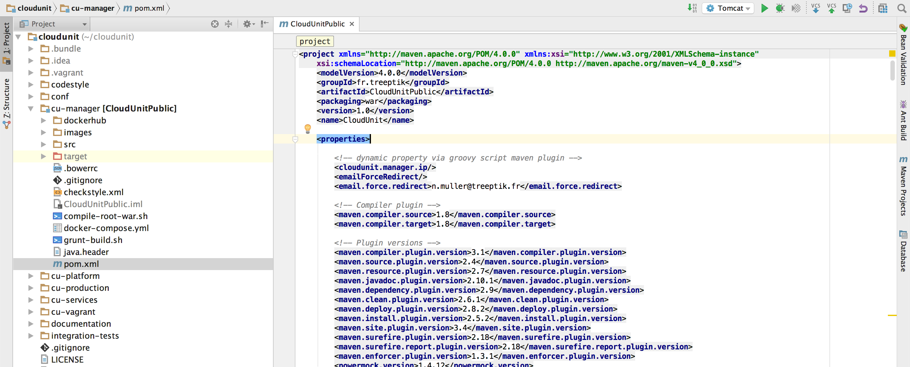
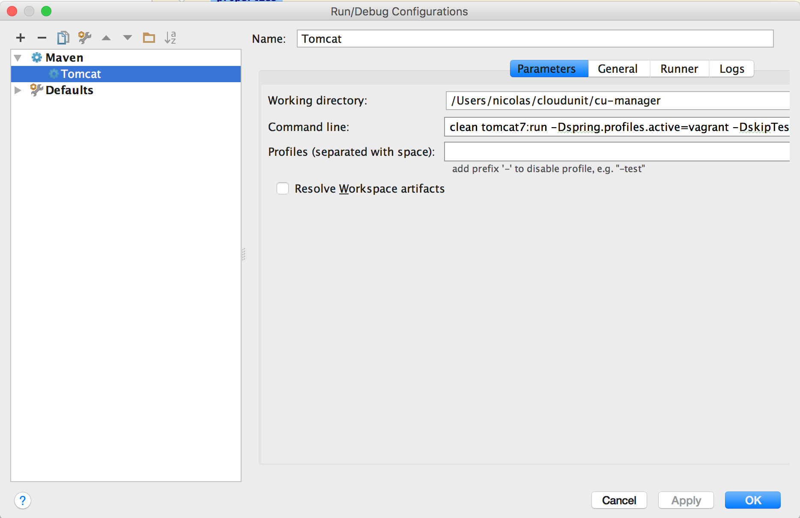

# CloudUnit developement environment

You are reading the wright guide, if you want to setup an environment to contribute to CloudUnit development.

## Requirements

* Linux Ubuntu/Debian
* Git / Java 1.8
* VirtualBox 5.0.4+ (www.virtualbox.org) - install before Vagrant
* Vagrant 1.8+ (www.vagrantup.com)
* Maven 3+ (maven.apache.org)

## Architecture for developpment

    

### General Rules

* You have to configure a local dns (see further) to send any requests from your host to VM (IP fixed at 192.168.50.4) 
* You use your favorite idea (intellij, Eclipse) to develop the maven project into 'cloudunit/cu-manager'.
* The backend is a spring application exposing a REST API
* The frontend is an AngularJS 1.4 consuming the backend API from Spring Java
* You run the project with an embedded tomcat via maven tasks (tomcat:run). No need to install Tomcat locally.
* Mysql is included into vagrantbox so no need to install it locally.

### Architecture sources

```
cloudunit/cu-manager  : Maven project 
cloudunit/cu-plaform  : Shell scripts for administration 
cloudunit/cu-services : Docker images
```

## Installation 

You can use script to autoinstall step 1 to 5 :
* [Ubuntu 15.04](https://github.com/Treeptik/cloudunit/blob/master/documentation/scripts/ubuntu-15.04.sh)
* [Ubuntu 16.04](https://github.com/Treeptik/cloudunit/blob/master/documentation/scripts/ubuntu-16.04.sh)


### Step 1 - Local DNS

CloudUnit uses Docker and Java but others components. As pre-requisites, you need to install them to have a complete dev stack. You need to install a local DNS for entry.
```
Dnsmasq is a lightweight, easy to configure DNS forwarder 
and DHCP server […] is targeted at home networks[.]
```
You need to add a local DNS entry pointing to the vagrant IP address.
More precisely, any address ending with **.cloudunit.dev** should be directed to **192.168.50.4**. 
On Ubuntu, a simple way to achieve this is to install dnsmasq:
```
sudo apt-get install dnsmasq
sudo vi /etc/dnsmasq.conf
# Add the line: address=/.cloudunit.dev/192.168.50.4                      
sudo service dnsmasq restart
```

You should ping **foo.cloudunit.dev** to **192.168.50.4**

### Step 2 - How to install Vagrant plugins
```
vagrant plugin install vagrant-reload
vagrant plugin install vagrant-vbguest
```

### Step 3 - How to install source code

```
cd $HOME && git clone https://github.com/Treeptik/cloudunit.git
```

### Step 4 - How to install Angular Project dependencies 

Follow these instructions :
```
Installation Node 5.x :
    curl -sL https://deb.nodesource.com/setup_5.x | sudo bash -
    sudo apt-get install nodejs
```

```
sudo npm install -g grunt grunt-cli bower 
cd $HOME/cloudunit/cu-manager/src/main/webapp && sudo npm install && sudo bower install
```

## Step 5 - How to build the vagrant box

Warning because this step could need lot of times !

```
$ cd $HOME/cloudUnit/cu-vagrant 
$ vagrant up
$ vagrant provision
```

## Step 6 - How to start the application

1 - Start the vagrantbox and run Docker into Vagrant

```
$ cd $HOME/cloudUnit/cu-vagrant 
$ vagrant up (if not running)
$ vagrant ssh 
cd cloudunit/cu-platform && ./reset-all.sh -y
```

2 - Start the Java Backend from Linux

```
$ cd $HOME/cloudUnit/cu-manager
$ mvn clean compile tomcat7:run -DskipTests -Dspring.profiles.active=vagrant
```

3 - Run the UI for development (http://0.0.0.0:9000) from Linux

```
$ cd $HOME/cloudUnit/cu-manager/src/main/webapp && grunt serve
```

# IDE CONFIGURATION

## ECLIPSE 

TODO

## INTELLIJ

Open the project with your favorite IDE into **root** directory and add **cu-manager** as Maven Project.
Simply select the **pom.xml** and right click to select this option.





You can run CloudUnit with a Maven task easily as :
    



# FAQ

All questions and answers about dev tasks

## How to reset Environment Development

```
vagrant ssh
cloudunit/cu-platform/reset-all.sh -y
```

## How to rebuild images

Update your sources, build the images and reninit the database :

```
$ vagrant ssh dev
$ cloudunit/cu-services/build-services.sh
$ cloudunit/cu-platform/reset-all.sh -y
```
