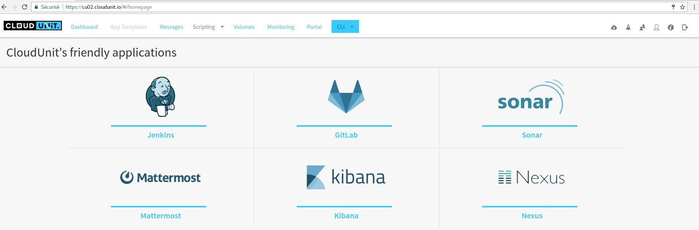
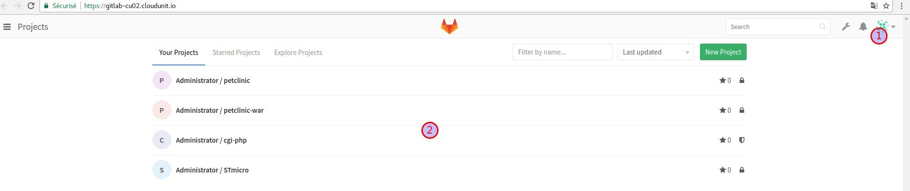
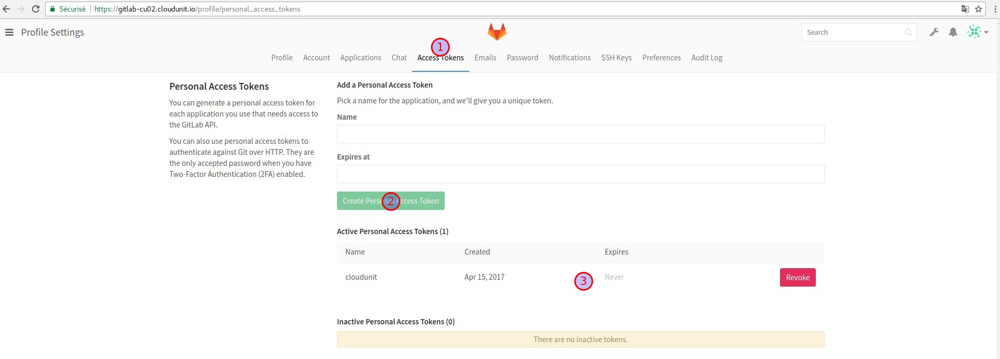
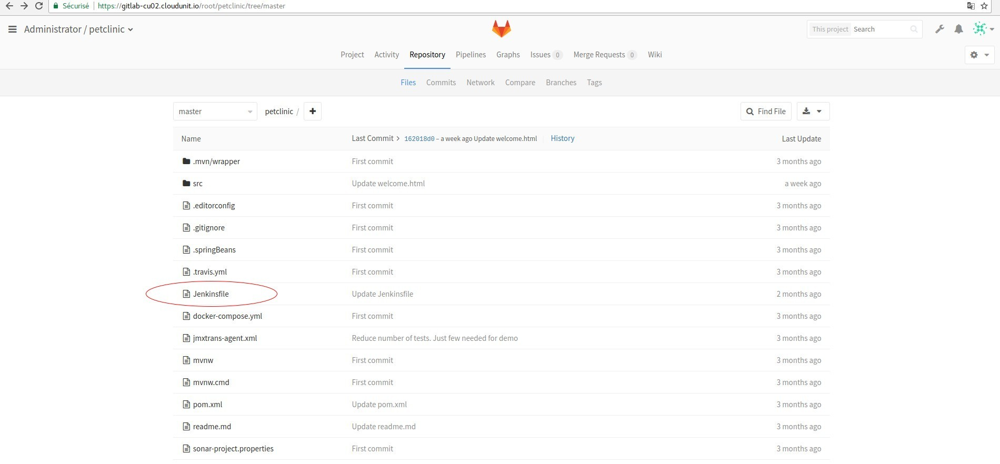
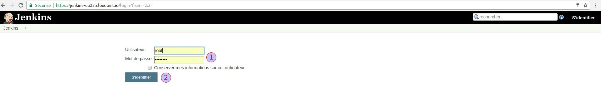
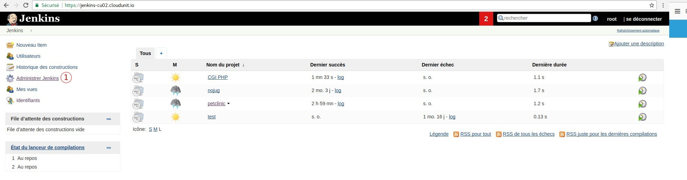
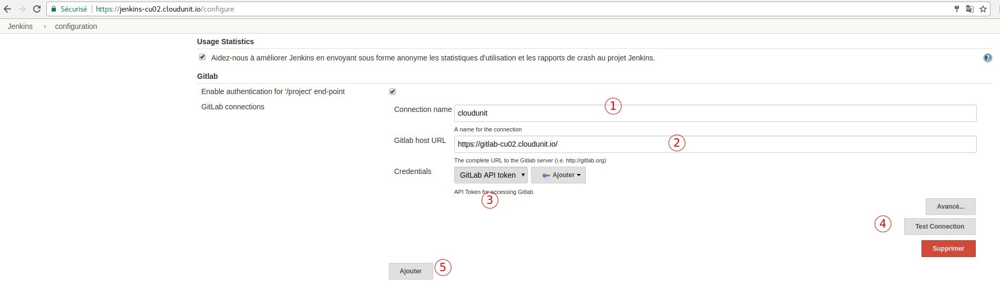
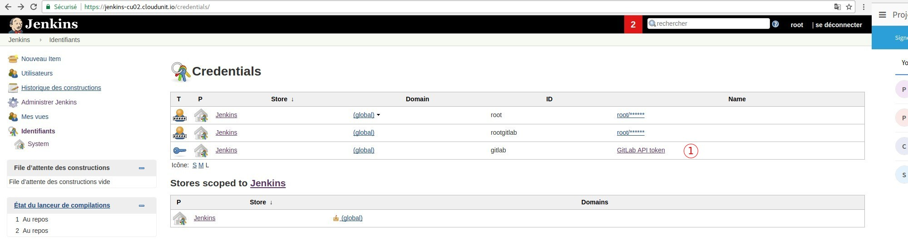
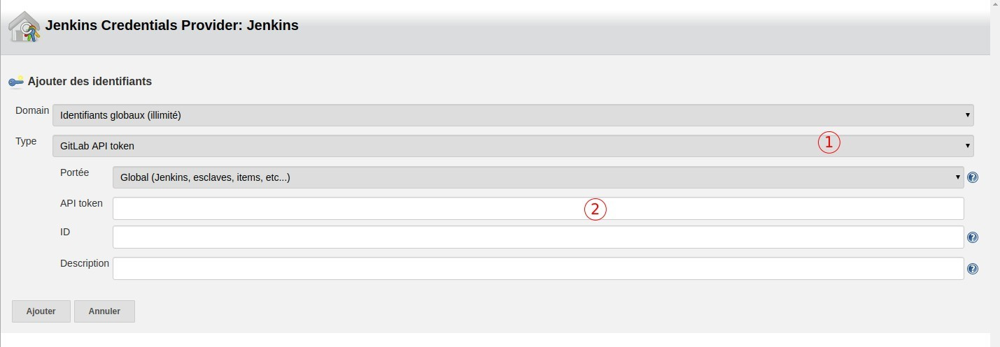

# Jenkins and GitLab configurations trigger build 
This document is a step by step configuration in order to activate automatique build on all behavior of GitLab. This setting is a trigger to multibranch job configuration, all modication on GitLab implies automatic build in CloudUni/Jenkins.
1. launch CloudUnit: https://cu02.cloudunit.io/#/dashboard

    `id: johndoe`
    
    `pwd: abc2015`
2. choose Portal
3. Configure GitLab and Jenkins

# GitLab configuration
## Create a GitLab key

Jenkins need the access token to listen to GitLab behaviors.
1. go to Profile Settings
2. Access Tokens

1. Add a Personnal Access Token

    `name: cloudunit`
    
    `Expire at: xxx`
    
2. Create button
 
`xxx` : leave it blanc to set it never or give expiration date.

`[important]`: don't forget to save the token ID.

## Jenkins file configuration
1. in your project, make sure that you have Jenkins file,

2. open your Jenkinsfile,
3. add GitLab Jenkins plugin properties line named `cloudunit` . `cloudunit` is the gitlab connection name,

    `properties([gitLabConnection('cloudunit')])`

# Jenkins configuration
## Requirement
 - Jenkins version 2.46.1 (Tested).

## GitLab Jenkinsfile 

    login:
     
      `id: root`
      `pwd: nausicaa`
    
1. go to Jenkins management,

    1. system configuration

    2. go to Gitlab panel

    `1. Connection name: cloudunit`
    `2. Gitlab host URL: https://gitlab-cu02.cloudunit.io/`
    `3. Credentials: Jenkins`  after, go to "How to add credentials"
    `4. Add button`
    
4. Save button

Go to `Identities` and make sure that you have generated credentials token.

## How to add credentials
In the Jenkins Credentials Provider: Jenkins,

1. Domain: Global identity
  
2. Domain: GitLab API token
  
3. Scope: Global
  
4. API token: Paste TOKEN ID HERE
  
5. ID: cloudunit
  
6. Description: My cloudunit GitLab/Jenkins
  
7. Add
