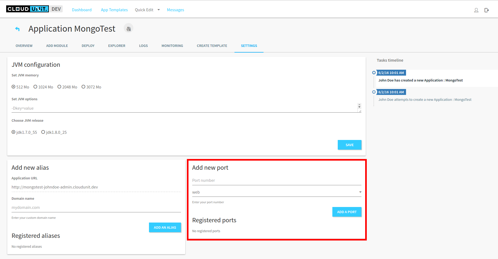
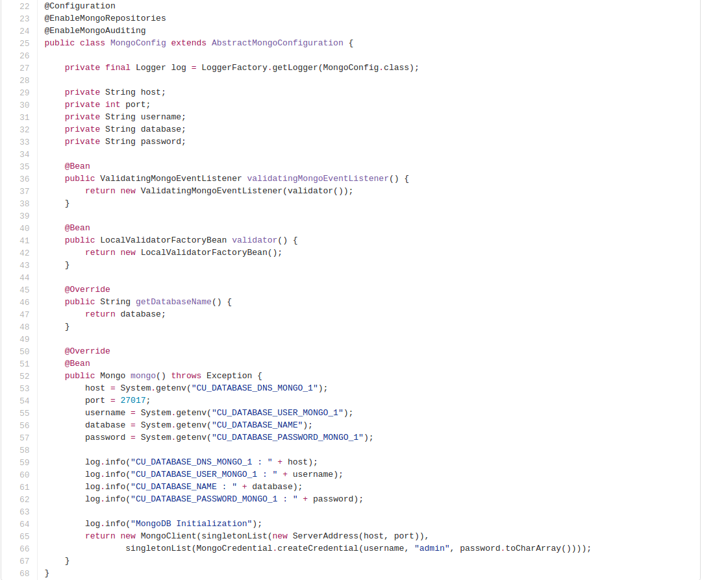

# CloudUnit using MongoDB

## Configure CloudUnit application to deploy your MongoDB application

For this exemple, you need to create a project into CloudUnit first.

Then, choose the right Java version you use in your application :


If you choose Tomcat 8 application, Java 8 is enable by default.

If you choose a FatJar application, create a port for your application if you need one in Settings page :



Then add Mongo module to your application :


Restart your application for update changes.

## Using environment variables in your application

CloudUnit provides you some variables for using in your application :

* CU_DATABASE_DNS_MONGO_1 : Host of MongoDB
* CU_DATABASE_USER_MONGO_1 : Username of MongoDB
* CU_DATABASE_PASSWORD_MONGO_1 : Password of MongoDB
* CU_DATABASE_NAME : Name of MongoDB database

CloudUnit use default port of MongoDB : 27017

You can use these variables in your Java application for initialize MongoDB module.

This is an exemple of MongoDB initialization in Java application :



## Using logs

CloudUnit provides you a log page for your application.
For using that feature, you need to add this lines in your application.properties file :

```
logging.file=system.out
logging.path=/cloudunit/appconf/logs
```

Then use the Logger class in Java classes :

```
import org.slf4j.Logger;
import org.slf4j.LoggerFactory;

Logger nameOfLogger = LoggerFactory.getLogger(Class.class);
```

## Packaging your application

When you have configure CloudUnit, implement your application using CloudUnit variable, you can package it for deploy to CloudUnit application.

For that, you have two ways to package a project :
* In your favorite IDE.
* In terminal : in the main folder of your project, use Maven command (after specify the good type of packaging in your pom.xml) : mvn package.

## Deploy your application in CloudUnit

For finish, you need to deploy your application into CloudUnit.
For that, go to Deploy page and use "SELECT FILE..." button to deploy your application :


## Exemple

For see an exemple of an application using MongoDB, you can go to this page where sources of an application exists : 
[MongoDB exemple](https://github.com/Treeptik/cloudunit-webapp-examples/tree/master/spring-boot-mongodb)
