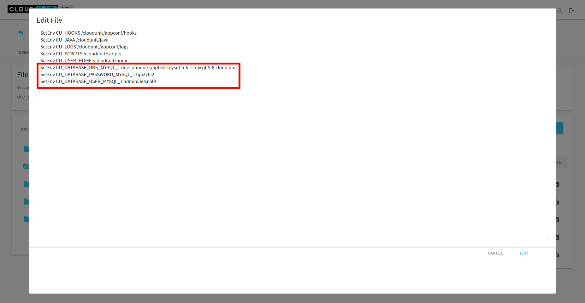
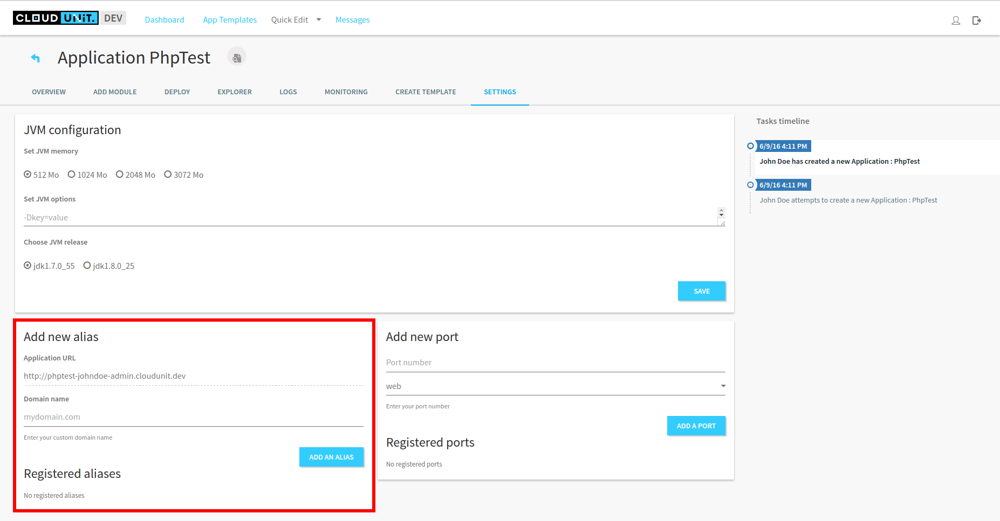
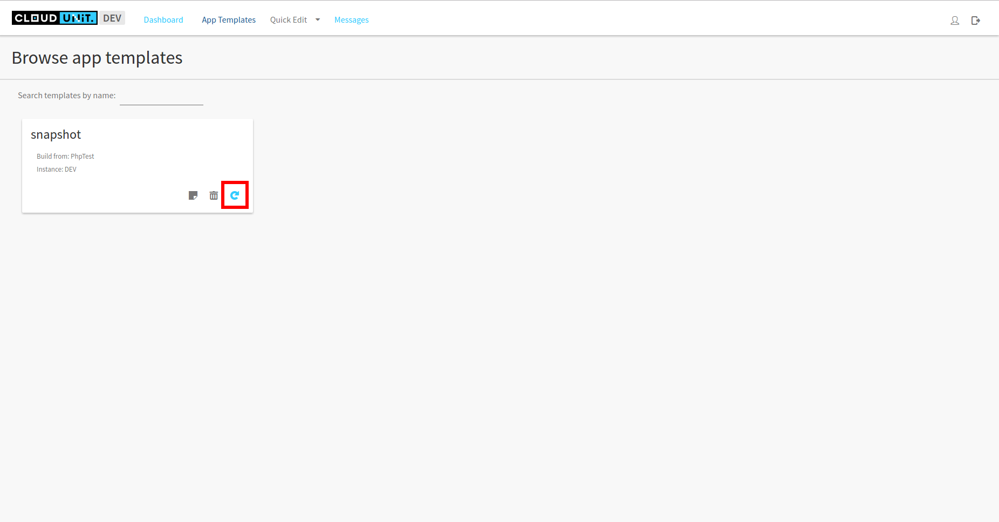
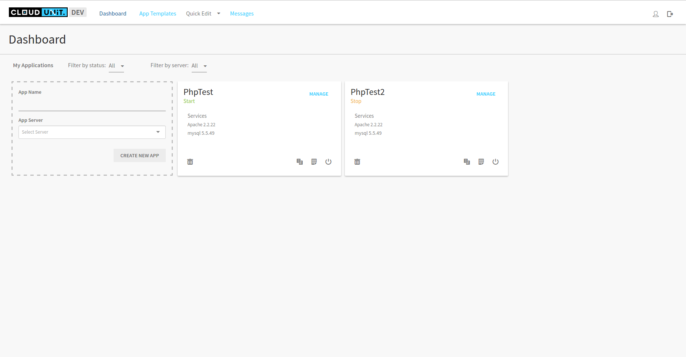

# Deploy an PHP application in CloudUnit

In this part, we will use WordPress in support like example.

## Create CloudUnit application

First, after launch CloudUnit, you need to create an Apache application.

## Configure the application

WordPress use MySQL for its databases. So, we need to add MySQL module. Version of MySQL doesn't matter in this example, choose the version you want to use.

You need to defined MySQL environment variables.
For that, edit the file */etc/apache2/conf.d/env-variables.conf* and add the lines described below.

In *Settings* tab, you can add a domain name if you want. For that, write your domain name and click on *Add an alias*.

Now, the application is configured, so restart it for update changes in *Overview* tab.

## Deploy WordPress

You can clone the Git repository [here](https://github.com/WordPress/WordPress.git).
After download, go to WorkPress directory and copy the file *wp-config-sample.php* then rename it to *wp-config.sh*.

Edit this file and add your MySQL configuration (host, database name, username, password) using environment variables which you can find in *Overview* tab.

Compress this directory in zip or tar.gz at your convenience and go to *Explorer* tab in */var/www* directory.
Use *Upload file* to add your compressed file to the application and uncompress it.

Then, edit the *index.html* file and replace the page with a redirect to your own index page.

Finally, open a new tab in your browser and go to your homepage (Use your domain name if you used this feature or use the name defined above).

That's all ! You have deploy an WordPress in CloudUnit.

## Clone the application

If you want to clone the application, you need to create a snapshot of this application.
For that, go to *Create template* tab, give a name (and a comment if you want) and click on *Create* button.

The next time is to create a new application using this snapshot.
Go to *App templates* tab and create a new application using this template.

And it's done, you have a new application which the exact copy of the first one.

