:toc: auto
:toc-position: left
:toclevels: 3
:sectnums:

= CloudUnit documentation
Welcome to CloudUnit documentation, it can help you to set up CloudUnit, learn about the system, or get your applications and workloads running on CloudUnit. To learn the basics of what CloudUnit is and how it works.
This document lets you try out CloudUnit right out of your web browser, using the cloudunit plateforme. Learn about the CloudUnit system and deploy, expose, scale, and upgrade a containerized application in just a few minutes.

:Author:    Treeptik
:Email:     contact@treeptik.fr
:Date:      2017
:Revision:  version 2.0.0

© 2017 Treeptik authors.

== What is CloudUnit
CloudUnit is an open source PaaS based on docker to automating build and deployment of your java application. Cloudunit can deploy all java application type and it is a RESTful application. CloudUnit includes a list of useful services like Elasticsearch, MondoDB, Postgresql, etc. Deployment can be on CLI or Web view.
You can also install CloudUnit on a server. If you want to install ClodUnit to a server, you have some requirements.

== Getting started
Picking the right solution can help you get a CloudUnit application up and running, either for local development. Setting Up / Delpoying CloudUnit Applications
Go to: https://cu01.cloudunit.io to begin.

=== Logging
Logging is composed by *<Username>* and *<Password>*. If you want to use private CloudUnit PaaS, you must contact Treeptik to open an account.

Let's begging...
This sample is for public user in order to test CloudUnit. This <id> is not a root user so your privileged is restricted. To have root account you must create new account given by Treeptik.

 Username: johndoe
 Password: abc2015
 > login

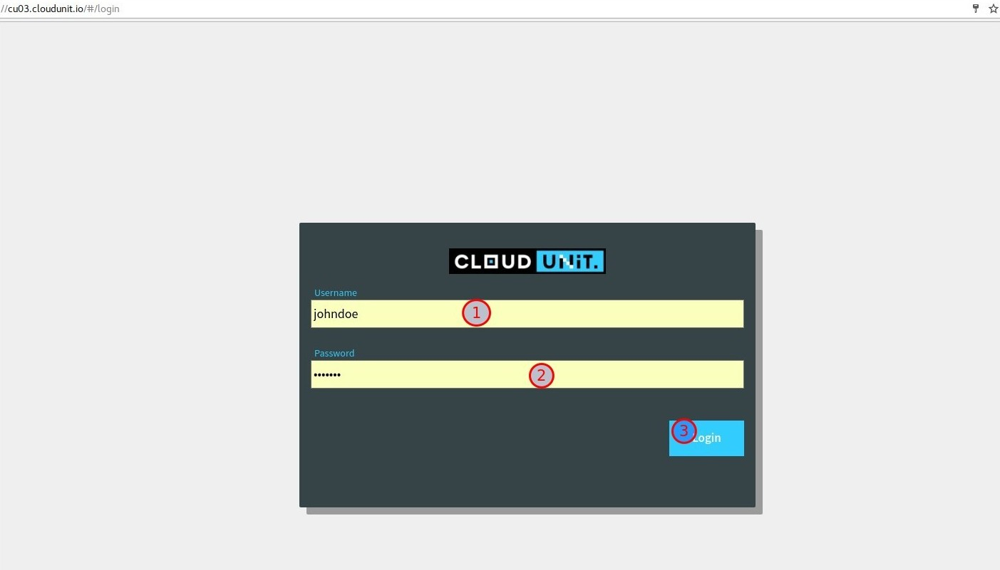

=== Create first application
The first step is to create an application base on java application. First, choose application server and giving a name. Let's  run a sample jsp page by .war file via CloudUnit. To make that, we need a Apache tomcat serveur in our application.

.create Apache Tomcat server:
----

*App Name*: testTomcat // <1>
*App Server*: Tomcat 8.0.39 // <2>
*'Create new application'*. // <3>

----
<1> name given for your application
<2> list of available server
<3> button create

'''

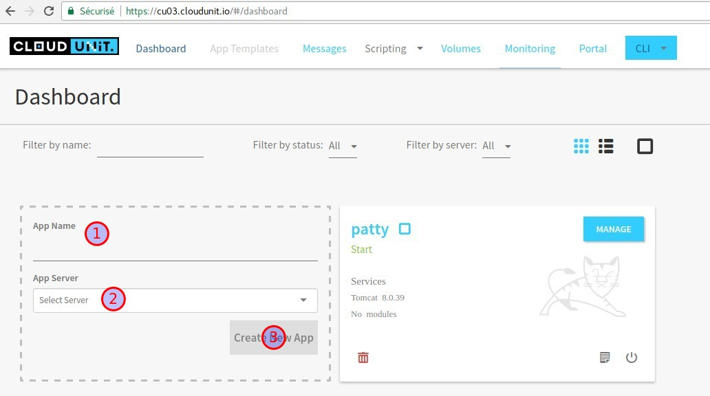

=== Manage application
Manage application gives ability to the user to add modules, deploy applications, explore services, check logs, monitoring, setting jvm configuration, variables environments, associate volumes, run commands.
The application that you create can be attached with anoter services call *module*.

.Manage server application and add module:
----

1. App Name: testTomcat // <1>
2. choose Manage // <2>

----
<1> give it a name, here the sample name is testTomcat
<2> Validate *'MANAGE'*

'''

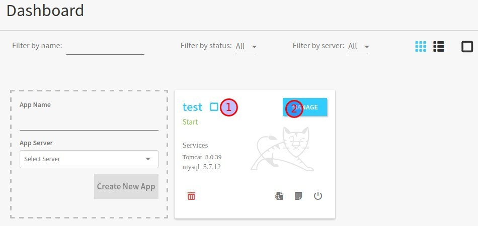

[WARNING]
===============================
- update link https://cu03.cloudunit.io/ instead of https://cu01.cloudunit.io/
===============================

==== Overview
Overview application stand to describe all information of the current application. You can also see all added modules on the application and all confgurations.

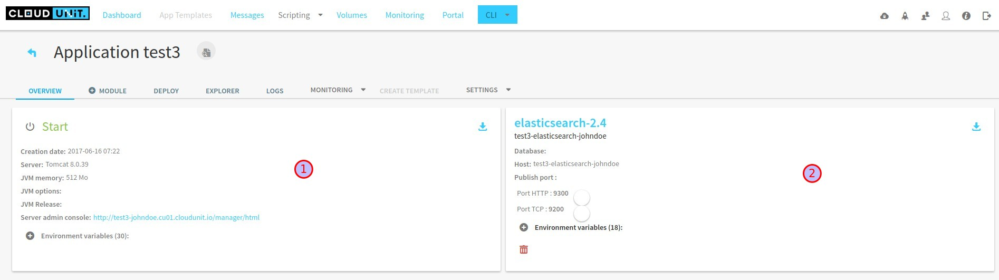

----

1. your application // <1>
2. module added // <2>

----
<1> All can have all the details of your application here, like creation date, server's name, JVM, server console admin, etc).
<2> The module added to your application and all details about it. You can have many modules. e.g: here with have elasticsearch 2.4 modules added into tomcat server.

[IMPORTANT]
===============================
- application's name is composed by <appName>-<moduleName>-<id>
- host url
- activate or desactivate port's modulefgh
- adding environment variables
===============================

==== Module
You can see modules as a service that depends on your application, it is usually a database like elasticserch, postgresql, mysql, etc.

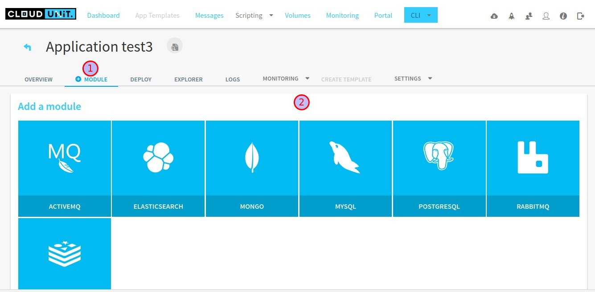

----

1. module section selected // <1>
2. list of available modules // <2>

----
<1> selected module page
<2> list of available modules that you can add to your application.

'''

==== Deploy
Deploying application in CloudUnit can be do in two ways:

* deploy by local source .ear or .war
* deploy by url

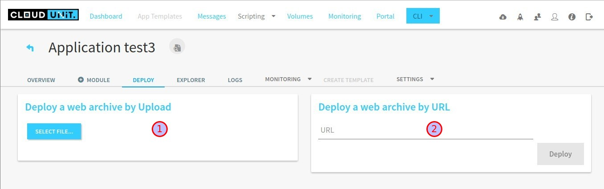

----

1. deploy as a .war or .ear (local) // <1>
2. deploy to host // <2>

----
<1> here you can add your web archive application to deploy.
<2> you can paste the url of your application here.

'''

==== Explorer

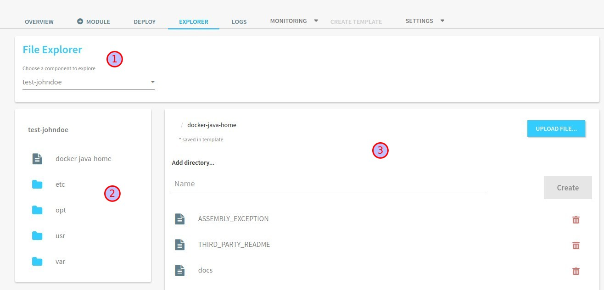

----

1. file explorer: you can choose between your application or your modules // <1>
2. tree of your application // <2>
2. manage your directory (filter, upload file, add/remove file or directory,...) // <3>

----
<1> select your application here to show details.
<2> Tree of the directory.
<3> manipulate directory.

'''

==== Logs
==== Monitoring
==== Create template
You can create a template for your application.

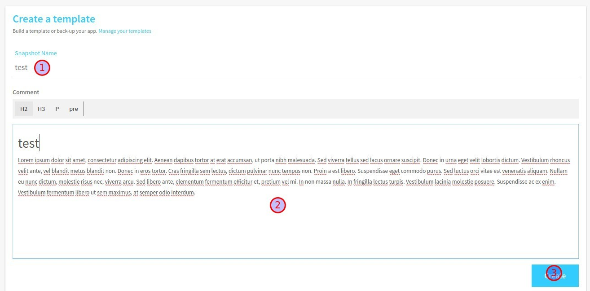

----

1. snapshot name // <1>
2. editor// <2>
2. validate // <3>

----
<1> snapshot is the name of the template, it refers as the name and version of the template.
<2> editor include tools to build template.
<3> button validation to create one template.

'''

==== Settings
JVM Configuration::
    You can scale the memory of the container between 512 mo and 4096 mo, and you can also ad a Dkey=value

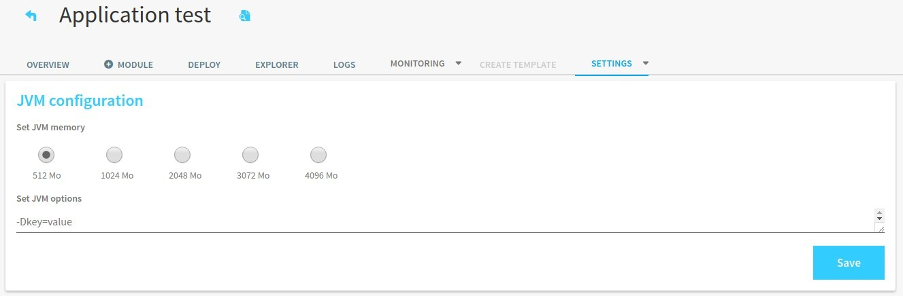

ENV Configuration::
    Variables Environment can be configured too. You can add, update, and delete variable of your application.

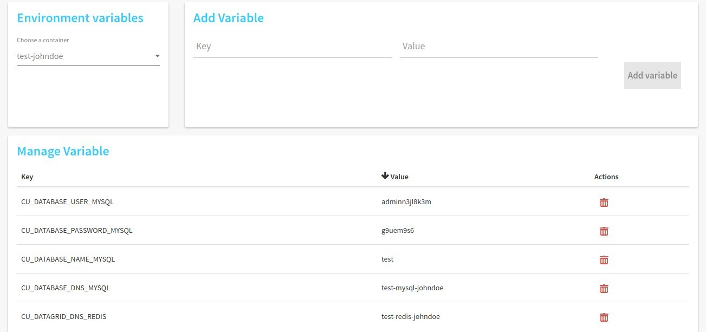

Volume association::
    Your application can be link with another container by path name in order to work together.

Command run::
    You can launch command docker run.

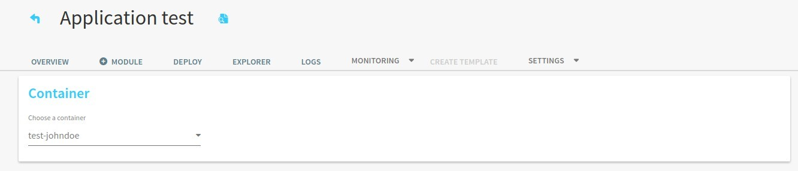

=== Deploying my first CloudUnit app: Tomcat-helloWorld.jsp

[IMPORTANT]
===============================
- make sure that you are logged into public account 'johndoe' (see 2.1 logging),
- make sure that you have a .war or .ear file if not check here : https://tomcat.apache.org/tomcat-6.0-doc/appdev/sample/
===============================
- create tomcat version 8.X application and name it,
- add module mysql version x.x,
- configure your tomcat, activate port,
- configure your mysql, activate port,
- in deploy section, select your sample.war
- open browser to check the result.

== Concepts, Tasks, and Tutorials
The CloudUnit documentation contains a number of resources to help you understand and work with CloudUnit.
Concepts provide a deep understanding of how CloudUnit works.
Tasks contain step-by-step instructions for common CloudUnit tasks.
Tutorials contain detailed walkthroughs of the CloudUnit workflow.

=== Dashboard
In dashboard view, you can see your created application and its details. Each application is a service and each service contains one or more modules. Dashboard offer user a simple overview of all services and informations about his module.

=== Add templates
Adding template to your server in order to assist users.

=== Messages
Message is the console log of your application. All information about your server appeared here, such as creation, deleting, updating, and else.
This section useful for developers in order to debug his application and all attached services.

=== Scripting
Create or launch script to set behavior of your application. In this section, you can play scripts or manage scripts.

=== Volumes
Volume is a repository mapped by your application. You can create, delete and add directory to your application.

=== Monitoring
Monitoring shows all of metrics from your application which can be system metrics, docker container metrics, http metrics, etc.

=== Portal

=== CloudUnit-CLI guide (Command Line Interface)

This guide is for a user who want to use CloudUnit with command line interface.

==== Requirements

For use this application, you need to have installed before :

* Available CloudUnit Manager 1.0
* Java Runtime Environment 1.7 or more

==== Download and launch the application

You can download the archive of application here. Or use :

 git clone git@github.com:Treeptik/CloudUnit-CLI.git

After download, you can launch the application by using these commands :

 cd CloudUnit-CLI
 mvn clean compile exec:java

You can run this application with Docker too :

 docker run --rm -it CloudUnit/cli

==== Help

When the application is running, you can access to help with the command help. This command will display all commands available in CloudUnit-CLI.

 CloudUnit-cli> help

If you wanna have an help on a specific command, you can use help with command in argument :

 CloudUnit-DEV-myapp>  help connect
Keyword:                   connect
Description:               Connect to CloudUnit Host
 Keyword:                  login
   Help:                   Your login
   Mandatory:              true
   Default if specified:   '__NULL__'
   Default if unspecified: '__NULL__'

 Keyword:                  password
   Help:                   User password
   Mandatory:              false
   Default if specified:   '__NULL__'
   Default if unspecified: ''

 Keyword:                  host
   Help:                   Host for CloudUnit Platform
   Mandatory:              false
   Default if specified:   '__NULL__'
   Default if unspecified: ''
* connect - Connect to CloudUnit Host

If you give a pattern in argument, the help command provides you commands with this pattern :

 CloudUnit-DEV-myapp>  help rm
* rm-alias - Remove an existing alias
* rm-app - Remove an application
* rm-module - Remove a module from the current application
* rm-snapshot - Remove the snapshot for the current application

==== Connection

You can connect to the CloudUnit Manager with the command :

 CloudUnit-cli> connect --login johndoe
Enter your password : ****
Trying to connect to default CloudUnit host...
Connection established

IMPORTANT: host is localhost(/127.0.0.1) but you can specify if you want an external host with the command :

 CloudUnit-cli> connect --login johndoe --host https://admin.CloudUnit.dev
Enter your password :

Trying to connect to default CloudUnit host...
Connection established

Now you are in the DEV context.

==== Application features

===== Create

You can create an application with the command :

 CloudUnit-DEV> create-app --name name --type tomcat-7
 Your application myapp is currently being installed
 After this command, you are in the application context.

===== Remove

You can delete an existing application :

 CloudUnit-DEV-myapp>  rm-app --name test
 test
 Confirm the suppression of your application: test - (yes/y) or (no/n)
 yes
 Your application test is currently being removed

===== Change context

When you have two or more applications created on CloudUnit, you can take control of an application with the command :

 CloudUnit-DEV-myapp>  use myapp2
 Current application : myapp2

===== Clone

*For this feature, you must have already created a snapshot*. You can clone an existing application :

 CloudUnit-DEV-myapp>  clone --tag tag --applicationName myapp
 Your application myapp2 was successfully created.

===== Display

You can display all informations about the current application :

 CloudUnit-DEV-myapp>  informations

 GENERAL
+----------------+--------+----------------+-----------+------+------------+
|APPLICATION NAME|AUTHOR  |STARTING DATE   |SERVER TYPE|STATUS|JAVA VERSION|
+----------------+--------+----------------+-----------+------+------------+
|myapp           |Doe John|2016-06-03 13:23|TOMCAT-7   |START |jdk1.7.0_55 |
+----------------+--------+----------------+-----------+------+------------+

 GIT ADDRESS
+----+--------------+
|TYPE|REMOTE ADDRESS|
+----+--------------+
|GIT |(NULL)        |
+----+--------------+

 SERVER INFORMATION
+--------+-------------+--------+------+--------+------+---------------------------------------------------------------+
|TYPE    |ADDRESS      |SSH PORT|STATUS|JVM OPTS|MEMORY|MANAGER LOCATION                                               |
+--------+-------------+--------+------+--------+------+---------------------------------------------------------------+
|TOMCAT-7|CloudUnit.dev|32774   |FAIL  |NONE    |1024  |http://manager-myapp-johndoe-admin.CloudUnit.dev/manager/html? |
+--------+-------------+--------+------+--------+------+---------------------------------------------------------------+

 MODULES INFORMATION
No modules found!
Terminated
Listing applications

You can list all applications :

 CloudUnit-DEV>  list-apps
+----------------+--------+----------------+-----------+------+
|APPLICATION NAME|AUTHOR  |STARTING DATE   |SERVER TYPE|STATUS|
+----------------+--------+----------------+-----------+------+
|test            |Doe John|2016-06-03 11:00|jboss-8    |START |
+----------------+--------+----------------+-----------+------+
|myapp           |Doe John|2016-06-03 13:23|tomcat-7   |START |
+----------------+--------+----------------+-----------+------+
|myapp2          |Doe John|2016-06-03 13:48|tomcat-6   |START |
+----------------+--------+----------------+-----------+------+
|myapp3          |Doe John|2016-06-03 14:07|tomcat-7   |START |
+----------------+--------+----------------+-----------+------+
|myapp4          |Doe John|2016-06-03 14:32|tomcat-7   |STOP  |
+----------------+--------+----------------+-----------+------+
|myapp5          |Doe John|2016-06-03 15:02|tomcat-6   |START |
+----------------+--------+----------------+-----------+------+

6 found !

===== Start and Stop

====== Start

You can start the application with start command. This command starts all services of this application too :

 CloudUnit-DEV-myapp>  start
 Your application myapp is currently being started
 Stop

After your application was started, you can stop it and its services with stop command :

 CloudUnit-DEV-myapp>  stop
 Your application myapp is currently being stopped

==== Features on an application
===== Listing containers

You can list all containers of an application :

 CloudUnit-DEV-test>  list-containers
+-------------------------+
|CONTAINER NAME           |
+-------------------------+
|dev-johndoe-test-tomcat-6|
+-------------------------+
1 containers found!

===== Environment variables
====== Add

You can create an environment variable to an application with this command :

 CloudUnit-DEV-test>  create-var-env --key key --value value
 test
 An environment variable has been successfully added to test
 Accents and specials characters are forbbiden in keys.

====== Remove

You can remove an environment variable if you use the command rm-var-env :

 CloudUnit-DEV-test>  rm-var-env --key key
 This environment variable has successful been deleted

====== Listing

You can list all environment variables of an application :

 CloudUnit-DEV-test>  list-var-env
+-----------------------------+------+
|CURRENT ENVIRONMENT VARIABLES|VALUES|
+-----------------------------+------+
|key                          |value |
+-----------------------------+------+
1 variables found!

======= Update
You can update a environment variable by modifying key, value or both.

 CloudUnit-DEV-test>  update-var-env --old-key key --new-key keyUpdated --value valueUpdated
 This environment variable has successful been updated

===== Aliases

====== Add

You can add an alias to an application with this command :

 CloudUnit> add-alias --alias treeptik.fr
 An alias has been successfully added to myapp
 Aliases must to respect some pattern (treeptik.fr, treeptik-test.fr, treeptik123.corp.eu)

====== Remove

You can remove an alias if you use the command rm-alias :

 rm-alias --alias treeptik.fr
 This alias has successful been deleted

====== Listing

You can list all aliases of an application :

 CloudUnit-DEV-myapp>  list-aliases
+---------------+
|CURRENT ALIASES|
+---------------+
|treeptik.fr    |
+---------------+
1 aliases found!

===== Ports

====== Add

You can open a port :

 CloudUnit-DEV-myapp>  open-port --name port --port 8080 --nature http
 port

====== Remove
You can remove a opened port :

 CloudUnit-DEV-myapp>  remove-port --name port --port 8080
 port

===== Java options
====== Add

You can add Java options (except memory options) to an application with this command :

 CloudUnit-DEV-myapp> add-jvm-option "option"
 Add java options to myapp application successfully

====== Change

You can change option of Java in your application :

* Change the version of Java which your application use :

 CloudUnit-DEV-myapp> change-java-version --javaVersion java7
 Your java version has been successfully changed
 You have access to three versions of Java : java7, java8 and java9

* Change the memory used by Java :
 CloudUnit-DEV-myapp> change-jvm-memory --size 512
 Change memory on myapp successful
 You have four options for memory : 512, 1024, 2048, 3072. By default, an application has memory of 512.

===== Modules
====== Add

You can add a module on your application with this command :

 CloudUnit-DEV-myapp> add-module --name mysql-5-5
 myapp
 Your module mysql-5-5 is currently being added to your application myapp
 You have four modules available : MySQL 5.5 (mysql-5-5), POSTGRES 9.3 (postgres-9-3), REDIS 3.0 (redis-3-0), MONGO 2.6 (mongo-2-6).

====== Remove

You can remove a existing module in an application :

 CloudUnit-DEV-myapp>  rm-module --name mysql-5-5
 myapp

Your module mysql-5-5 is currently being removed from your application myapp
====== Listing

You can display informations about all modules of an application with the command display-modules :

 CloudUnit-DEV-myapp>  display-modules
 MODULES INFORMATION
+-----------+---------------------------------------------------------------+
|MODULE NAME|mysql-5-5-1                                                    |
+-----------+---------------------------------------------------------------+
|TYPE       |mysql-5-5                                                      |
+-----------+---------------------------------------------------------------+
|DOMAIN NAME|johndoe-myapp-mysql-5-5-1.mysql-5-5.cloud.unit                 |
+-----------+---------------------------------------------------------------+
|PORT       |3306                                                           |
+-----------+---------------------------------------------------------------+
|USERNAME   |adminom8cdo5u                                                  |
+-----------+---------------------------------------------------------------+
|PASSWORD   |p3v19ir0                                                       |
+-----------+---------------------------------------------------------------+
|DATABASE   |myapp                                                          |
+-----------+---------------------------------------------------------------+
|MANAGER    |http://phpmyadmin1-myapp-johndoe-admin.CloudUnit.dev/phpmyadmin|
+-----------+---------------------------------------------------------------+

===== Snapshots
====== Create

You can create a snapshot of an application using :

 CloudUnit-DEV-myapp>  create-snapshot --tag tag1 --applicationName myapp
 myapp
 A new snapshot called tag1 was successfully created.

====== Remove

You can delete a snapshot of an application :

 CloudUnit-DEV>  rm-snapshot --tag tag1
 The snapshot tag1 was successfully deleted.
 If an application use the template which you want to remove :

 CloudUnit-DEV-myapp>  rm-snapshot --tag tag1
At least one application uses this template. You must delete it before.

====== Listing

You can list all snapshots of an application :

 CloudUnit-DEV-myapp>  list-snapshot
 No snapshots found!
 0 snapshots found

===== Deploy an archive on your application

You can deploy an archive on your application. This archive have to be in ear or war file type.

 CloudUnit-DEV-myapp>  deploy --path ~/CloudUnit-webapp-examples/pizzaiolo-mysql/target/pizzashop-1.0.0.war --openBrowser true
 War deployed - Access on http://myapp-johndoe-admin.CloudUnit.dev

===== Run commands

====== Listing

You can list all command files in a container with this command :

 CloudUnit-DEV-test>  list-commands --container-name dev-johndoe-test-wildfly-8
+--------------------+------------------------+-----------+
|CURRENT COMMAND     |ARGUMENT NUMBER REQUIRED|ARGUMENTS  |
+--------------------+------------------------+-----------+
|create_datasource.sh|2                       |NAME DRIVER|
+--------------------+------------------------+-----------+
1 commands found!

==== Globales features

===== Volume management

Create a volume

You can create a volume with this command :

 CloudUnit-DEV>  create-volume --name volumeTest
 The volume volumeTest was been successfully created

===== Remove a volume
You can remove a volume :

 CloudUnit-DEV>  rm-volume --name volumeTest
This volume has successful been deleted

===== Mount a volume on a application

When you have created your volume, you can mount it on an existant application (You must use an absolute path for this command) :

 CloudUnit-DEV-test>  mount-volume --volume-name volumeTest --path /CloudUnit/ --container-name dev-johndoe-test-tomcat-6 --application-name test
This volume has successful been mounted

===== Unmount a volume on a application

Once your volume mount on your application, you can unmount it with the command :

 CloudUnit-DEV-test>  unmount-volume --container-name dev-johndoe-test-tomcat-6 --volume-name volumeTest
This volume has successful been unmounted

===== Clear the console

You can clear the console by two ways :

 CloudUnit-DEV-myapp> clear
 CloudUnit-DEV-myapp> cls

===== Get the current date and time

You can have the current date and time :

 CloudUnit-DEV-myapp>  date
vendredi 3 juin 2016 14 h 34 CEST

===== Get exit code of the last CU command executed

For get this informations, you need to use the command echo :

 CloudUnit-DEV-myapp>  echo 0

===== Display all shell's properties

You can see all shell's variables with the command shell properties :

 CloudUnit-DEV-myapp>  system properties
 awt.toolkit = sun.awt.X11.XToolkit
 classworlds.conf = /usr/share/maven/bin/m2.conf
 ...
 user.language = fr
 user.name = username
 user.timezone = Europe/Paris

===== Version
You can the version of CloudUnit CLI with the command version :

 CloudUnit-DEV-myapp>  version 1.0
Access to operating system (OS) shell

If you use ! before a command, the shell executes the command like an OS command :

 CloudUnit-DEV-myapp>  ! echo "Hello World !"
command is:echo "Hello World !"
"Hello World !"

===== Automating

If you wanna execute some commands in a file, you can use the command script :

 CloudUnit-cli> script --file ../../Connect.sh
connect --login johndoe --password abc2015
Trying to connect to default CloudUnit host...
Connection established
Script required 0.731 seconds to execute

Tip: You can only execute commands available on CloudUnit-CLI, not OS commands.

Comments

The // and ; characters, if these characters start lines, allow to print comments :

 CloudUnit-DEV-myapp>  // Remove an application
 CloudUnit-DEV-myapp>  ; Remove an application
 CloudUnit-DEV-myapp>  rm-app --name myapp
 myapp
 Confirm the suppression of your application: myapp - (yes/y) or (no/n)
 yes
 Your application myapp is currently being removed
 Exit the shell

For exit CloudUnit-CLI and return the standard shell, you need to use this command :

 CloudUnit-DEV-myapp>  exit
 You can use the command quit too :

 CloudUnit-DEV-myapp>  quit

==== Disconnection

You can disconnect with the command disconnect :

 CloudUnit-DEV-myapp>  disconnect
 Disconnect

==== creating and deploying an application Script exemple

This is an exemple of script which connect to an account, create an application, download a git repository, package it and deploy it on CloudUnit-CLI :

 connect --login johndoe --password abc2015
 create-app --name myapp --type tomcat-7
 ! git clone https://github.com/Treeptik/CloudUnit-webapp-examples.git
 ! mvn clean package -f CloudUnit-webapp-examples/spring-boot-mongodb/pom.xml
 deploy --path CloudUnit-webapp-examples/spring-boot-mongodb/
 disconnect

Now, you'll just run the command :

 CloudUnit-cli> script --file /home/username/script.sh

== API and Command References
The Reference documentation provides complete information on the CloudUnit APIs.

== Tools
The Tools page contains a list of native and third-party tools for CloudUnit.

== Troubleshooting
The Troubleshooting page outlines some resources for troubleshooting and finding help.

== Frequently Asked Questions
