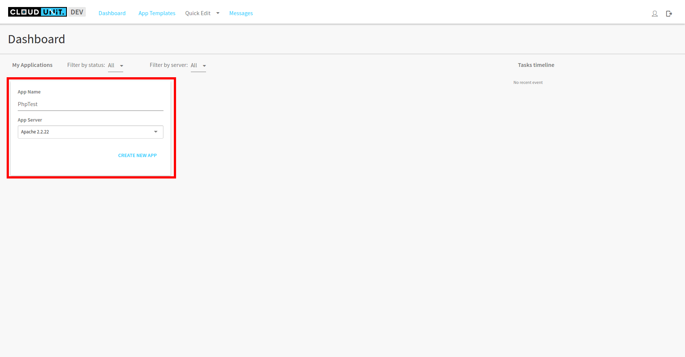
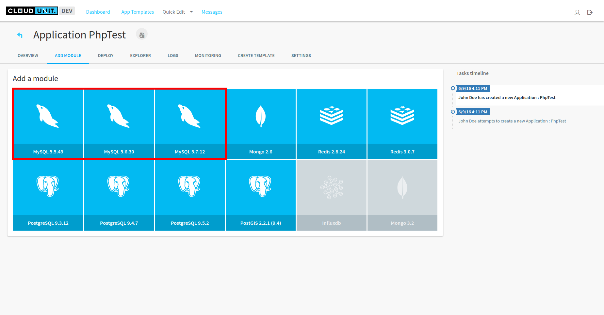
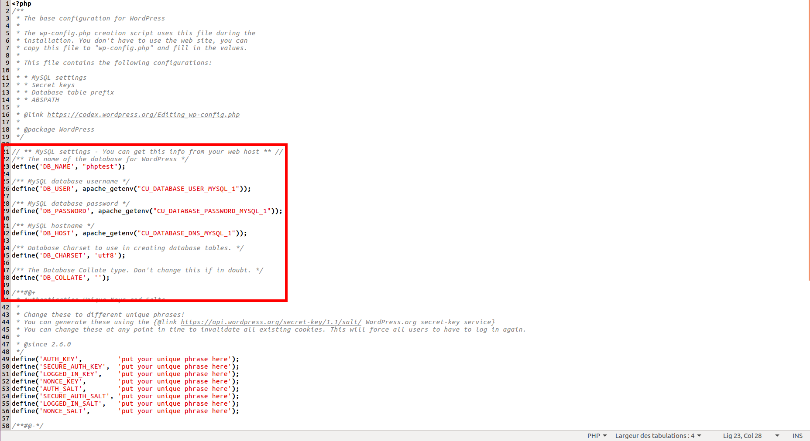
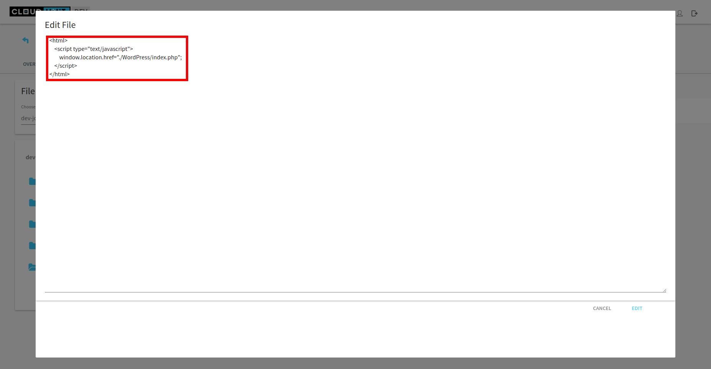
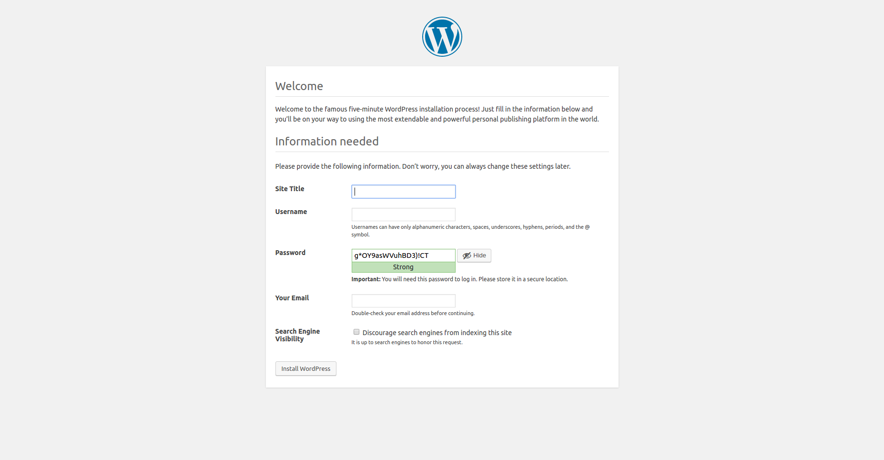

# Deploy an PHP application in CloudUnit

In this part, we will deploy a WordPress to show you how it works.

## Create CloudUnit application

First, when CloudUnit is started and you are logged in, you need to create an Apache application.



## Configure the application

WordPress use MySQL for its databases. So, we need to add MySQL module. The version of MySQL doesn't matter in this example. Choose the version you want to use.




## Deploy WordPress

You can clone the Git repository [here](https://github.com/WordPress/WordPress.git).
After download, go to WorkPress directory and copy the file *wp-config-sample.php* then rename it to *wp-config.php*.

Edit this file and change MySQL configuration (host, database name, username, password) using environment variables which you can find in *Overview* tab.

You can use apache_getenv or you can directly use values of environment variables. 

Here's a reminder to show you the correspondance between *wp-config.php* and CloudUnit environment variables.

DB_NAME corresponds to CU_DATABASE_NAME_MYSQL <br />
DB_USER corresponds to CU_DATABASE_USER_MYSQL <br />
DB_PASSWORD corresponds to CU_DATABASE_PASSWORD_MYSQL <br />
DB_HOST corresponds to CU_DATABASE_DNS_MYSQL <br />

You don't need to modify anything else.




Compress this directory in zip or tar.gz at your convenience and go to *Explorer* tab in */var/www/html* directory.
Use *Upload file* to add your compressed file to the application and use the button beside the archive to unzip it.

Then, edit the *index.html* file and replace the page with a redirect to your own index page.

Here's an example for the index.html : 
``` 
<html>
  <script type="text/javascript"> 
	window.location.href = "./WordPress/index.php";
  </script>
</html>
```




Finally, open a new tab in your browser and go to your homepage or use the *Open in browser* button in your on the top of your interface .

That's all ! You have deploy an WordPress in CloudUnit.




