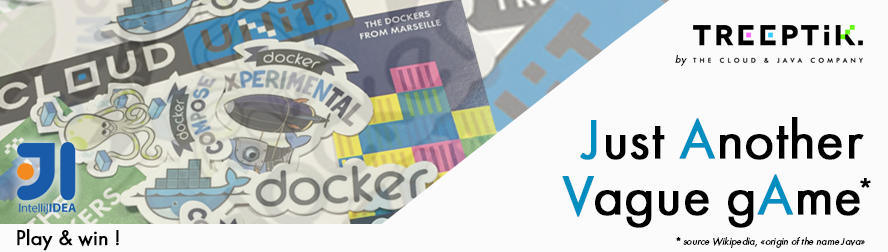

CloduUnit Developer Contest #1
==========================

**We are very excited to share with you today our very first CloduUnit Developer Contest !!**

##How to enter 
Do you have an idea for an improvement, new feature, or updated design? Any idea, big or small, can win you an **Intellij personal license** ! 

 1. Try the [oneline version of CloudUnit](https://sormiou.cloudunit.io/) or [Install your own](https://github.com/Treeptik/cloudunit/)
 2. Create issues with **Feature Label** and explain with the more detail as possible your idea
 3. Cross your finger ! 

All issues must be made by **COMING SOON**. We will evaluate each of them and choose a winner the week after. 

##Prizes

* Grand prize : One Intellij personal license
* For the second and third  : A pack of really cool stickers 

##How to win
Want to help your issues rise above the competition? Do any or all of the following to increase your odds of winning:

1. Tweet about your participation in the contest with the #CloudUnit Hastag. 
2. Blog about it and include a link in your tweet
3. Go the extra mile – submit more than one improvement

